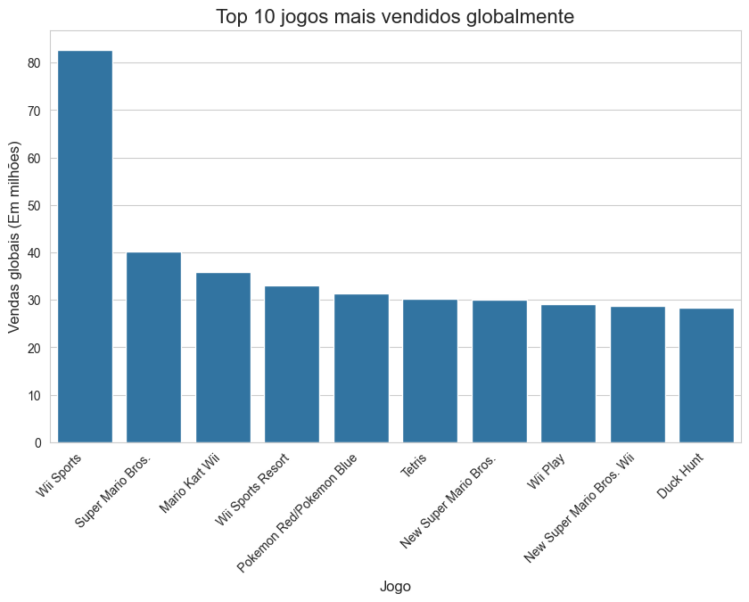
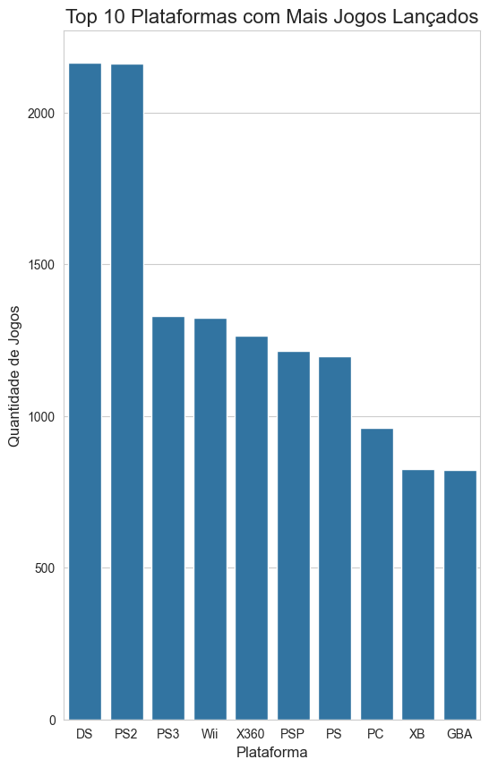
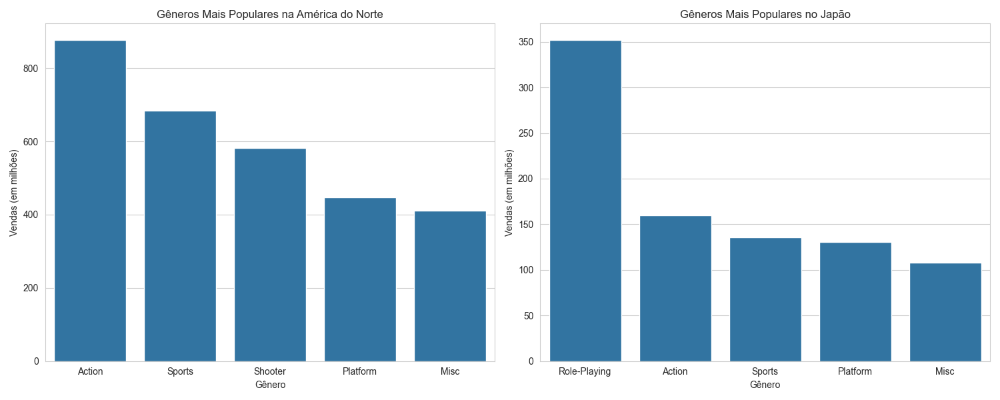

# 🎮 Análise Exploratória de Vendas de Videogames

Este repositório contém uma análise exploratória de dados (EDA) sobre o dataset "Video Game Sales", que abrange vendas de jogos com mais de 100.000 cópias vendidas de 1980 a 2016. O projeto visa extrair insights sobre tendências de mercado, popularidade de plataformas e preferências regionais de gênero.

## 🎯 Sobre o Projeto

O objetivo deste projeto é aplicar técnicas de análise de dados para responder a perguntas de negócio específicas, utilizando Python e bibliotecas populares do seu ecossistema. Através da manipulação e visualização dos dados, investigamos quais foram os jogos e plataformas de maior sucesso e como o gosto dos jogadores varia entre as principais regiões do mundo.

---

## 🚀 Tecnologias Utilizadas

O projeto foi desenvolvido utilizando as seguintes tecnologias:

* 
* 
* 
* 
* 

---

## 🔧 Como Executar o Projeto

Para executar a análise em sua máquina local, siga os passos abaixo:

1.  **Clone o repositório:**
    ```bash
    git clone [https://github.com/FeuSouza6k/BuscandoDadosDeUmaTabela.git](https://github.com/FeuSouza6k/BuscandoDadosDeUmaTabela.git)
    ```

2.  **Acesse o diretório do projeto:**
    ```bash
    cd SEU-REPOSITORIO
    ```

3.  **(Recomendado) Crie e ative um ambiente virtual:**
    * No Windows:
        ```bash
        python -m venv venv
        .\venv\Scripts\activate
        ```
    * No Mac/Linux:
        ```bash
        python3 -m venv venv
        source venv/bin/activate
        ```

4.  **Instale as dependências a partir do arquivo `requirements.txt`:**
    ```bash
    pip install -r requirements.txt
    ```

5.  **Execute o script de análise ou abra o notebook:**
    * Para rodar o script Python:
        ```bash
        python seu_script_de_analise.py
        ```
    * Para abrir no Jupyter Notebook:
        ```bash
        jupyter notebook seu_notebook.ipynb
        ```

---

## ✨ Análises Realizadas

O projeto foca em responder às seguintes perguntas:

* Quais são os 10 jogos mais vendidos de todos os tempos globalmente?
* Qual plataforma (console) teve o maior número de jogos lançados em sua história?
* Qual gênero de jogo é o mais popular na América do Norte em comparação com o Japão?

---

## 📊 Resultados e Visualizações

As análises geraram os seguintes gráficos para ilustrar os insights encontrados:

### Top 10 Jogos Mais Vendidos Globalmente
*Este gráfico de barras mostra os gigantes da indústria, destacando o volume de vendas que os tornou icônicos.*



### Top 10 Plataformas com Mais Jogos Lançados
*Esta visualização compara as plataformas para identificar qual delas possui a maior biblioteca de jogos, indicando uma forte presença no mercado ao longo do tempo.*



### Gêneros Mais Populares: América do Norte vs. Japão
*Estes gráficos comparam os gêneros mais vendidos nas duas regiões, revelando diferenças culturais claras nas preferências dos jogadores.*



---

## ✒️ Autor

Projeto desenvolvido por **Felipe Rodrigues**.

* **LinkedIn:** [https://www.linkedin.com/in/feliperodriguesdesouzaa/](https://www.linkedin.com/in/feliperodriguesdesouzaa/)
* **GitHub:** [https://github.com/FelipeSouzaz6k](https://github.com/FelipeSouza6k)